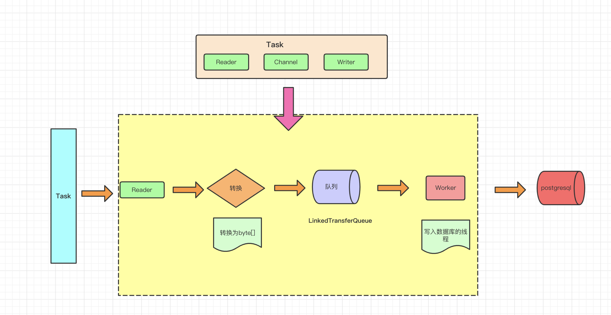
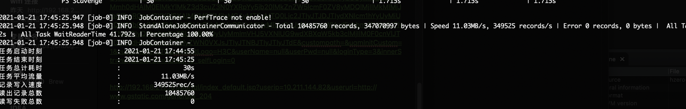

# PgCopyWriter 插件文档


___

## 1 快速介绍

PgCopyWriter插件实现了写入数据到 PostgreSQL(HAWQ、GreenPlumn)主库目的表的功能。在底层实现上，PostgresqlWriter通过JDBC连接远程 PostgreSQL 数据库，并执行相应的 Pg Copy from STDIN 语句将数据写入 PostgreSQL，内部会分批次提交入库。

PgCopyWriter面向ETL开发工程师，他们使用PgCopyWriter从数仓导入数据到PostgreSQL｜Greenplum。同时 PgCopyWriter亦可以作为数据迁移工具为DBA等用户提供服务。


## 2 实现原理

PgCopyWriter通过 DataX 框架获取 Reader 生成的协议数据，根据你配置生成相应的Copy插入语句

    注意：
    1. 目的表所在数据库必须是主库才能写入数据；整个任务至少需具备 insert into...|copy的权限，是否需要其他权限，取决于你任务配置中在 preSql 和 postSql 中指定的语句。对于greenplum，同时可以指定session参数。
    2. PostgresqlWriter和MysqlWriter不同，不支持配置writeMode参数。
    3. 注意，copy方式对表名、字段名有严格要求

#### 转换架构



## 3 功能说明

### 3.1 配置样例

* 这里使用一份从mysql产生到 PostgresqlWriter导入的数据。

```json
{
  "job": {
    "setting": {
      "speed": {
        "channel": 3
      },
      "errorLimit": {
        "record": 0,
        "percentage": 0
      }
    },
    "content": [
      {
        "reader": {
          "name": "mysqlreader",
          "parameter": {
            "username": "root",
            "password": "root",
            "column": [
              "`id`",
              "`name`",
              "`age`",
              "`birthday`"
            ],
            "splitPk": "id",
            "connection": [
              {
                "table": [
                  "datax_copy_test"
                ],
                "jdbcUrl": [
                  "jdbc:mysql://127.0.0.1:3306/test?useCompression=true&fetchSize=10240"
                ]
              }
            ]
          }
        },
        "writer": {
          "name": "pgcopywriter",
          "parameter": {
            "username": "gpadmin",
            "password": "gpadmin",
            "column": [
              "id",
              "name",
              "age",
              "birthday"
            ],
            "batchSize" : 102400,
            "session": [],
            "connection": [
              {
                "table": [
                  "test.datax_copy"
                ],
                "jdbcUrl": "jdbc:postgresql://127.0.0.1:5432/test?currentSchema=test"
              }
            ]
          }
        }
      }
    ]
  }
}
```


### 3.2 参数说明

* **jdbcUrl**

    * 描述：目的数据库的 JDBC 连接信息 ,jdbcUrl必须包含在connection配置单元中。

      注意：1、在一个数据库上只能配置一个值。
      2、jdbcUrl按照PostgreSQL官方规范，并可以填写连接附加参数信息。具体请参看PostgreSQL官方文档或者咨询对应 DBA。


  * 必选：是 

  * 默认值：无

* **username**

  * 描述：目的数据库的用户名 

  * 必选：是 

  * 默认值：无

* **password**

  * 描述：目的数据库的密码

  * 必选：是

  * 默认值：无

* **table**

  * 描述：目的表的表名称。支持写入一个或者多个表。当配置为多张表时，必须确保所有表结构保持一致。

               注意：table 和 jdbcUrl 必须包含在 connection 配置单元中

  * 必选：是

  * 默认值：无 

* **column**

  * 描述：目的表需要写入数据的字段,字段之间用英文逗号分隔。例如: "column": ["id","name","age"]。如果要依次写入全部列，使用\*表示, 例如: "column": ["\*"]

               注意：1、我们强烈不推荐你这样配置，因为当你目的表字段个数、类型等有改动时，你的任务可能运行不正确或者失败
                    2、此处 column 不能配置任何常量值

  * 必选：是 

  * 默认值：否


* **session**
  * 描述: DataX在获取postgresql连接时，执行session指定的SQL语句，修改当前connection session属性
  * 必须: 否
  * 默认值: 空


* **preSql**

  * 描述：写入数据到目的表前，会先执行这里的标准语句。如果 Sql 中有你需要操作到的表名称，请使用 `@table` 表示，这样在实际执行 Sql 语句时，会对变量按照实际表名称进行替换。比如你的任务是要写入到目的端的100个同构分表(表名称为:datax_00,datax01, ... datax_98,datax_99)，并且你希望导入数据前，先对表中数据进行删除操作，那么你可以这样配置：`"preSql":["delete from @table"]`，效果是：在执行到每个表写入数据前，会先执行对应的 delete from 对应表名称 <br />

  * 必选：否 

  * 默认值：无 

* **postSql**

  * 描述：写入数据到目的表后，会执行这里的标准语句。（原理同 preSql ）

  * 必选：否

  * 默认值：无

* **batchSize**
* 描述：**一次copy提交的记录数大小**，该值可以极大减少DataX与PostgreSql的网络交互次数，并提升整体吞吐量。改值根据数据量可自行增大。
	
* 必选：否
	
* 默认值：**102400**

### 3.3 类型转换

PgCopyWriter采用CSV的形式导入，但仍然需要指定类型，以对数据进行处理。

下面列出PgCopyWriter针对 PostgreSQL类型转换列表:

| DataX 内部类型| PostgreSQL 数据类型    |
| -------- | -----  |
| Long     |bigint, bigserial, integer, smallint, serial |
| Double   |double precision, money, numeric, real |
| String   |varchar, char, text, bit|
| Date     |date, time, timestamp |
| Boolean  |bool|
| Bytes    |bytea|

## 4 性能报告

### 4.1 环境准备

**mysql**

```shell
docker run -p 3306:3306 --name mysql \
-v $PWD/conf:/etc/mysql \
-v $PWD/logs:/var/log/mysql \
-v $PWD/data:/var/lib/mysql \
-e MYSQL_ROOT_PASSWORD=root \
-d mysql:5.7
```

**greenplum**

```shell
docker run -itd -p 5432:5432 --name greenplum_6.11 projectairws/greenplum 
# 默认密码 gpadmin/gpadmin
```

#### 4.1.1 数据特征

##### Mysql建表语句

```sql
create table datax_copy_test
(
	id int auto_increment,
	name varchar(64) null,
	age int null,
	birthday datetime default now() null,
	constraint datax_copy_test_pk
		primary key (id)
)
comment 'datax_copy_test';

drop table datax_copy_test;

# 插入数据
insert into datax_copy_test(name, age) value("Albert Einstein1", 18);
insert into datax_copy_test(name, age) value("Albert Einstein2", 19);
insert into datax_copy_test(name, age) value("Albert Einstein3", 20);
insert into datax_copy_test(name, age) value("Albert Einstein4", 21);
insert into datax_copy_test(name, age) value("Albert Einstein5", 22);
insert into datax_copy_test(name, age) value("Albert Einstein6", 18);
insert into datax_copy_test(name, age) value("Albert Einstein7", 19);
insert into datax_copy_test(name, age) value("Albert Einstein8", 20);
insert into datax_copy_test(name, age) value("Albert Einstein9", 21);
insert into datax_copy_test(name, age) value("Albert Einstein10", 22);

# 反复新增
insert into datax_copy_test(name, age)  select name,age from datax_copy_test;

# 查询数据量
select count(*) from datax_copy_test;
```

##### gp建表语句

```sql
create table test.datax_copy
(
    id       integer,
    name     text,
    age      integer,
    birthday timestamp
)distributed by (id);
comment on table test.datax_copy is 'datax_copy';

drop  table datax_copy;
truncate table datax_copy;
select count(1) from datax_copy;
```


### 4.2 测试报告

#### 4.2.1 单表测试报告



#### 4.2.2 性能测试小结
1. `channel数对性能影响很大`

2. `通常不建议写入数据库时，通道数指定2～3即可

   


## FAQ

***

**Q: PostgresqlWriter 执行 postSql 语句报错，那么数据导入到目标数据库了吗?**

A: DataX 导入过程存在三块逻辑，pre 操作、导入操作、post 操作，其中任意一环报错，DataX 作业报错。由于 DataX 不能保证在同一个事务完成上述几个操作，因此有可能数据已经落入到目标端。

***

**Q: 按照上述说法，那么有部分脏数据导入数据库，如果影响到线上数据库怎么办?**

A: 目前有两种解法，第一种配置 pre 语句，该 sql 可以清理当天导入数据， DataX 每次导入时候可以把上次清理干净并导入完整数据。
第二种，向临时表导入数据，完成后再 rename 到线上表。

***
